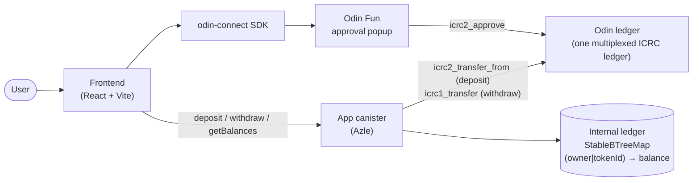

# odin-app-template

Reference canister app template for building on **Odin Fun**. Fork it, deploy it, and you have a working app with Odin Connect auth, deposit/withdraw flows, and an internal multi-token ledger.

## Stack

- **Canister**: [Azle](https://github.com/demergent-labs/azle) (TypeScript, Internet Computer)
- **Frontend**: React + TypeScript + Vite, [odin-connect](https://www.npmjs.com/package/odin-connect) SDK
- **Tooling**: dfx, pnpm workspace

## Architecture



**Deposit**: the user approves the app canister as an ICRC-2 spender through the
Odin Fun popup; the canister then pulls the approved funds itself
(`icrc2_transfer_from` on the Odin ledger) and credits the user's internal
balance. It is permissionless and self-verifying — a credit is only recorded for
funds that actually settled into the canister.

**Withdraw**: the user calls `withdraw`; the canister debits the internal
balance (persisted *before* the transfer await) and sends the tokens back out on
the Odin ledger (`icrc1_transfer`), refunding on failure.

## Layout

```
packages/
  canister/   # Azle canister — internal multi-token ledger
  frontend/   # Vite + React app — Odin Connect auth + deposit/withdraw UI
dfx.json      # canister (azle) + frontend (asset) canister config
```

## Prerequisites

- [Node.js](https://nodejs.org) 22+ (see `.nvmrc`)
- [pnpm](https://pnpm.io) 10+
- [dfx](https://internetcomputer.org/docs/current/developer-docs/getting-started/install) 0.31+
- [Rust](https://www.rust-lang.org/tools/install) + `wasm32-unknown-unknown` target (required by Azle)

```sh
rustup target add wasm32-unknown-unknown
```

## Quick start

```sh
pnpm install          # install workspace deps (auto-installs the azle dfx extension if dfx is on PATH)
dfx start --clean --background
dfx deploy            # build + deploy canister and frontend
```

> If `pnpm install` ran before `dfx` was installed, register the azle dfx extension manually:
>
> ```sh
> pnpm --filter @odin-app/canister exec azle extension install
> ```

Frontend dev server:

```sh
pnpm dev:frontend
```

## Scripts

| Command                | Description                          |
| ---------------------- | ------------------------------------ |
| `pnpm build`           | Build all workspace packages         |
| `pnpm build:canister`  | Build the Azle canister              |
| `pnpm build:frontend`  | Build the frontend                   |
| `pnpm dev:frontend`    | Start the Vite dev server            |
| `pnpm typecheck`       | Type-check all packages              |
| `pnpm test`            | Run unit tests (ledger)              |

## Canister API

| Endpoint        | Kind   | Description                                                        |
| --------------- | ------ | ----------------------------------------------------------------- |
| `deposit`       | update | Pull pre-approved funds from the Odin ledger and credit the caller. |
| `withdraw`      | update | Debit the caller's balance and send tokens back via the Odin ledger. |
| `getBalance`    | query  | Caller's internal balance for one token.                          |
| `getBalances`   | query  | All of the caller's `(token, balance)` pairs.                     |
| `getOwner`      | query  | The configured owner principal, or empty if not yet initialized.  |
| `icrc28_trusted_origins` | update | [ICRC-28](https://github.com/dfinity/wg-identity-authentication) trusted origins — the web origins allowed to request signed calls. Odin Connect calls this before issuing a delegation and refuses auth if your app's origin is not listed. |

> **ICRC-28 / Odin Connect auth:** the trusted origins are configured in
> `TRUSTED_ORIGINS` in
> [`packages/canister/src/index.ts`](packages/canister/src/index.ts). Each entry
> must be a bare origin (`scheme://host[:port]`, no trailing slash, no path);
> https only, except `http://localhost` in dev. The signer does an exact string
> match. **Edit this list to your deployed frontend origin before going live** —
> a wrong or missing origin fails login silently. It must be `update` (not
> `query`): the signer issues a replicated call so the response is certified.

Tokens are identified by their **Odin token id** (text), not an ICRC ledger
principal — every Odin token shares one ledger and is addressed by subaccount
(`odin_token_pointer`). Balances are keyed by `(owner, tokenId)` and stored in
stable memory, so they survive upgrades.

### Withdrawal fees

The Odin ledger charges a flat **BTC fee (100 sats) to the sender** on every
transfer. On withdraw the sender is the app canister, so the canister must hold
a small BTC float on the Odin ledger — otherwise withdrawals trap with
`error 910: Insufficient BTC funds to cover transfer fee`.

This template **subsidizes** the fee from that float for simplicity. Fund the
canister by transferring some sats to its principal from the Odin app, then top
it up as needed.

> **Production note:** subsidizing is griefable (spam withdrawals drain the
> float). A production app should make the **withdrawer pay** — track a per-user
> BTC balance in the internal ledger and debit the 100-sat fee on each withdraw
> (refund on failure, same as the token debit). See the `NOTE (fees)` comment on
> `withdraw` in [`packages/canister/src/index.ts`](packages/canister/src/index.ts).

## Deploy to mainnet

1. Make sure you have a cycles-funded identity (`dfx identity get-principal`,
   then fund it with cycles — see the
   [cycles docs](https://internetcomputer.org/docs/current/developer-docs/getting-started/cycles/cycles-wallet)).

2. Build and deploy to the IC:

   ```sh
   pnpm build                       # frontend dist + canister type check
   dfx deploy --network ic          # deploy canister + frontend asset canister
   ```

3. The deploying principal is recorded as the **owner** (see `@init` in
   [`packages/canister/src/index.ts`](packages/canister/src/index.ts)) — a
   generic admin handle for any admin-gated endpoints you add later. Deposits are
   **not** owner-gated: `deposit` is permissionless and self-verifying (it pulls
   the caller's own pre-approved funds before crediting), so no trusted minter is
   needed.

4. Note the canister IDs printed on deploy; the frontend reads them from the
   generated `.env` (`output_env_file` in `dfx.json`).

5. **Set your trusted origins.** Edit `TRUSTED_ORIGINS` in
   [`packages/canister/src/index.ts`](packages/canister/src/index.ts) to the
   origin your frontend is served from (e.g. your asset-canister URL or custom
   domain), then redeploy. Odin Connect login fails until your origin is listed.
   Verify with:

   ```sh
   dfx canister call canister icrc28_trusted_origins '()' --network ic
   ```

6. **Fund the canister with BTC** so withdrawals can pay the Odin ledger fee
   (see [Withdrawal fees](#withdrawal-fees)). From the Odin app, transfer some
   sats to the app canister's principal; otherwise `withdraw` traps with
   `error 910`.

## How to extend

**Add support for a new token** — no code change needed. Tokens are identified
by their Odin token id (text); pass the id to `deposit` / `withdraw` /
`getBalance`. The ledger keys every balance by `(owner, tokenId)`, so new tokens
work out of the box.

**Add a new canister endpoint** — add a `@query` / `@update` method in
[`packages/canister/src/index.ts`](packages/canister/src/index.ts). ⚠️ Add code
*around* the hardened ledger core, never inside the `BEGIN/END HARDENED LEDGER
CORE` markers in
[`packages/canister/src/ledger.ts`](packages/canister/src/ledger.ts). See
[`CLAUDE.md`](CLAUDE.md) for the full guardrails.

**Frontend changes** — UI, components, and styling under
[`packages/frontend/src`](packages/frontend/src) are free to modify. Auth and
flows are built on the [odin-connect](https://www.npmjs.com/package/odin-connect)
SDK.
